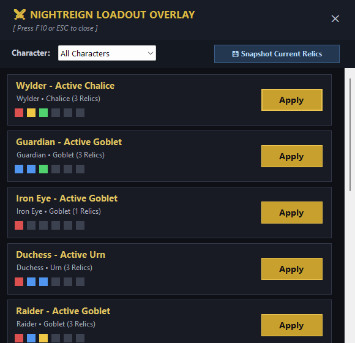

# Nightreign Relic Extractor

[](https://github.com/hakimnouira/NightreignRelicExtractor/releases/latest)
[](https://github.com/hakimnouira/NightreignRelicExtractor/raw/main/NightreignRelicExtractor.exe)

[](#)
[](#)
[](#)
[](#)

A fast, lightweight, and completely standalone Windows tool for **Elden Ring Nightreign** that provides:
1. **⚱️ In-App Vessel & Relic Builder**: Customize and equip your 6-relic vessel builds (3 Normal + 3 Deep) for all 10 characters and 7 vessel types (Urn, Goblet, Chalice, etc.) with slot color constraints and instant inventory search.
2. **🎮 In-Game HUD Overlay & Loadout Switcher (F10)**: Swap 6-relic vessel builds with 1 click while playing in-game (fullscreen / borderless). **Other multiplayer co-op players do NOT need to install anything!**
3. **📥 Relic Inventory Extractor**: Extracts your full relic inventory from `.co2` / `.sl2` save files directly into **CSV** and **Excel (.xlsx)**.
4. **🔒 Guaranteed Automatic Backups**: A timestamped backup (`.bak_YYYYMMDD_HHMMSS`) is **always** created before any modification to your save file.

---

### In-Game Overlay & Main Interface

| In-Game HUD Overlay (Hotkey: `F10`) | Main Vessel Builder & Extractor |
|:---:|:---:|
|  |  |

---

## ⚱️ Interactive Vessel & Relic Builder

Build and test optimal relic combinations directly in the app:
- **All 10 Characters Supported**: Wylder, Guardian, Iron Eye, Duchess, Raider, Revenant, Recluse, Executor, Scholar, Undertaker.
- **All 7 Vessel Types**: Urn, Goblet, Chalice, Soot-Covered Urn, Sealed Urn, Decrepit Goblet, Forgotten Goblet.
- **Slot Color Matching**: Enforces character vessel color rules (🔴 Red, 🔵 Blue, 🟡 Yellow, 🟢 Green, ⚪ Any).
- **Normal & Deep Relics**: Slots 1–3 for standard relics, Slots 4–6 for Deep relics.
- **Live Search & Filter**: Search by relic name or effect description (e.g. *Physical Attack*, *HP Regen*, *Blood loss*).
- **One-Click Equip & Safe Save**: Writes the build into your save file and sets it active. **Always creates a timestamped `.bak` before touching the file!**
- **Save as Preset**: Save your build directly into your presets list to access it in the in-game F10 overlay!

---

## 🎮 In-Game Overlay & Loadout Switcher (Hotkey: `F10`)

Switching relics has never been easier — and works seamlessly with mods like **MMV (More Map Variations)** and **Seamless Co-Op**:

### Why Other Players Don't Need Any Mod:
In FromSoftware multiplayer netcode, your client broadcasts your equipped vanilla relic IDs to other players. Because their game already has the vanilla data, their client natively displays and calculates your relics without needing any third-party app installed!

### How to Use the In-Game Overlay:
1. Launch **`NightreignRelicExtractor.exe`** before or while running the game.
2. In-game (Fullscreen or Borderless Windowed), press **`F10`** anytime to toggle the dark HUD overlay.
3. Select your character (e.g. *Wylder*, *Guardian*, *Duchess*, *Recluse*).
4. Click **`⚡ Apply`** next to your desired loadout preset:
   - The app instantly modifies the save file and creates an automatic timestamped backup (`.bak`).
5. **Quit to the Main Menu and click 'Continue' or 'Load Game'** (~5 seconds).
6. You spawn back into the session with your new relic loadout active and synced with everyone!
7. **Create New Builds**: Click **`💾 Snapshot Current Relics`** anytime to capture whatever you currently have equipped in-game directly into a saved preset!

---

## ⚡ Quick Download & Run (No Install Needed)

You do **not** need to install Python, Node.js, or any package managers. The program is 100% portable and runs on any Windows 10 or 11 PC:

1. **[Click here to download NightreignRelicExtractor.exe](https://github.com/hakimnouira/NightreignRelicExtractor/raw/main/NightreignRelicExtractor.exe)** (or visit [Releases](https://github.com/hakimnouira/NightreignRelicExtractor/releases)).
2. Double-click **`NightreignRelicExtractor.exe`** to open the interface.
3. Click **Auto-Detect** (or **Browse...** to pick your `NR0000.co2`), then switch to the **Vessel Builder** or **Loadouts & Overlay** tab.

---

## Key Features

- **Safe Automatic Backup Guarantee**: Every write operation unconditionally creates both a timestamped backup (`.bak_YYYYMMDD_HHMMSS`) and `.bak` before modifying anything.
- **Relic Extraction**: Extracts every physical relic in your save file into cleanly formatted CSV and Excel spreadsheets.
- **Accurate Unknown Effect Handling**: Preserves raw effect IDs and descriptions without crashing on unmapped rolls.
- **Zero-Mod Multiplayer**: Vanilla save ID writing ensures friends in co-op don't need to install any mod or tool.
  - **CLI / Drag-to-EXE Mode**: Run headless from PowerShell/Command Prompt or drag your `.co2` file directly onto the executable icon.

---

## How to Use

### Method 1: Graphical Interface (Recommended)
1. Double-click **`NightreignRelicExtractor.exe`**.
2. Click **Auto-Detect** to find your save automatically in AppData, click **Browse...** to choose it manually, or simply drag and drop `NR0000.co2` anywhere onto the window.
3. Click **Extract Relics**.
4. Use the quick buttons (**Open CSV**, **Open Excel**, **Open Output Folder**) to immediately view your inventory!

### Method 2: Drag and Drop onto Executable
- Drag your `NR0000.co2` file directly onto the **`NightreignRelicExtractor.exe`** file icon in Windows Explorer.
- The `relics.csv` and `relics.xlsx` files will be generated right next to your save file.

### Method 3: Command Line (Headless)
Open PowerShell or Command Prompt in the folder:
```powershell
.\NightreignRelicExtractor.exe NR0000.co2
```

Console Output:
```text
Nightreign Relic Extractor
Input: NR0000.co2
Relics found: 118
CSV: relics.csv
Excel: relics.xlsx
Original save modified: NO
```

---

## Output Files

The tool generates two files in the same folder as your input save:

1. **`relics.csv`**:
   - Encoded in **UTF-8 with BOM** for perfect display in Microsoft Excel, LibreOffice, and Google Sheets without encoding issues.
2. **`relics.xlsx`**:
   - Ready-to-use Excel workbook with:
     - Styled headers with contrasting dark slate fill and bold white text.
     - **Frozen top row** so headers remain visible when scrolling.
     - **Auto-Filter enabled** on all 18 columns for sorting and filtering by Color, Type, Name, or specific Effects.
     - Auto-sized columns formatted for high readability.

### Columns Included

| # | Column Name | Description |
|---|---|---|
| 1 | `#` | Row index (1-indexed) |
| 2 | `Relic ID` | Unique instance ID of the physical relic in the save |
| 3 | `Item ID` | Base item ID (maps to the relic model/name) |
| 4 | `Relic Name` | Relic name (e.g. *Grand Tranquil Scene*, *Night Of The Baron*) |
| 5 | `Color` | Relic color (*Red*, *Blue*, *Yellow*, *Green*) |
| 6 | `Relic Type` | Relic classification (*Relic*, *DeepRelic*, *UniqueRelic*) |
| 7–9 | `Effect 1 ID` / `Effect 1` / `Effect 1 Value` | Primary effect ID, name, and magnitude/value |
| 10–12 | `Effect 2 ID` / `Effect 2` / `Effect 2 Value` | Secondary effect ID, name, and magnitude/value |
| 13–15 | `Effect 3 ID` / `Effect 3` / `Effect 3 Value` | Tertiary effect ID, name, and magnitude/value |
| 16–18 | `Effect 4 ID` / `Effect 4` / `Effect 4 Value` | Quaternary effect (empty if relic has fewer than 4 effects) |

---

## Building from Source

The project uses only native .NET Framework APIs pre-installed on Windows 10 and 11. No external packages, NuGet restores, or compiler installations are required.

To rebuild `NightreignRelicExtractor.exe`:
- Double-click **`build.bat`**, or
- Run the following command from PowerShell:
```powershell
& "C:\Windows\Microsoft.NET\Framework64\v4.0.30319\csc.exe" /nologo /codepage:65001 /utf8output /optimize+ /target:exe /out:NightreignRelicExtractor.exe /r:System.Windows.Forms.dll /r:System.Drawing.dll /r:System.IO.Compression.dll /r:System.IO.Compression.FileSystem.dll /r:System.Web.Extensions.dll /res:items_data.json,items_data.json /res:effects_data.json,effects_data.json NightreignRelicExtractor.cs PresetManager.cs SaveRelicWriter.cs OverlayForm.cs RelicPickerDialog.cs
```

---

## Acknowledgments & Research

Relic container structures and item/effect databases are based on open-source research from [ERN_RelicForge](https://github.com/cetusk/ERN_RelicForge).

## License

This project is licensed under the [MIT License](LICENSE).
