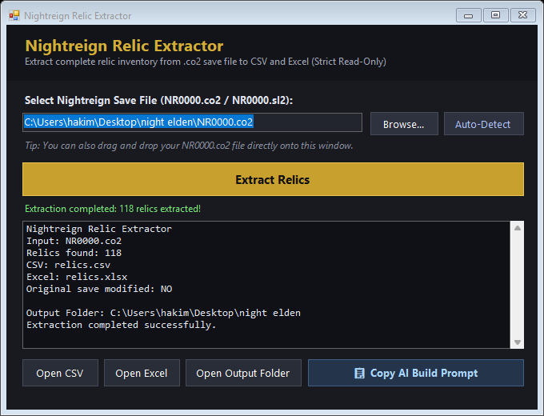

# Nightreign Relic Extractor

[](https://github.com/hakimnouira/NightreignRelicExtractor/releases/latest)
[](https://github.com/hakimnouira/NightreignRelicExtractor/raw/main/NightreignRelicExtractor.exe)

[](#)
[](#)
[](#)
[](#)

A fast, lightweight, and completely standalone Windows tool whose sole purpose is to extract your relic inventory from an **Elden Ring Nightreign** `.co2` or `.sl2` save file directly into **CSV** and **Excel (.xlsx)** — with a built-in **AI Build Optimizer Prompt** to generate custom builds in ChatGPT, Claude, or Gemini!

---



---

## ⚡ Quick Download & Run (No Install Needed)

You do **not** need to install Python, Node.js, or any package managers. The program is 100% portable and runs on any Windows 10 or 11 PC:

1. **[Click here to download NightreignRelicExtractor.exe](https://github.com/hakimnouira/NightreignRelicExtractor/raw/main/NightreignRelicExtractor.exe)** (or visit [Releases](https://github.com/hakimnouira/NightreignRelicExtractor/releases)).
2. Double-click **`NightreignRelicExtractor.exe`** to open the interface.
3. Click **Auto-Detect** (or **Browse...** to pick your `NR0000.co2`), then click **Extract Relics**.
4. That's it! Your `relics.xlsx` and `relics.csv` files will appear immediately.

---

## 🤖 AI Build Optimizer (ChatGPT / Claude / Gemini)

Once you extract your relics, you can turn your spreadsheet into custom, high-tier character builds using AI:

1. Click **📋 Copy AI Build Prompt** inside the application (or view [PROMPT.md](PROMPT.md)).
2. Open your favorite AI chatbot (**ChatGPT**, **Claude**, or **Gemini**).
3. **Upload / attach your generated `relics.xlsx`** (or `relics.csv`).
4. **Paste (Ctrl+V) the prompt** into the chat and send!

The AI will analyze your actual relic inventory, enforce vessel color constraints and deep relic rules, and recommend the best 6-relic combinations for each character (Wylder, Guardian, Duchess, Recluse, etc.).

---

## Key Features

- **Strict Read-Only Guarantee**: Opens save files strictly with `FileAccess.Read` and `FileShare.ReadWrite`. **Never modifies, overwrites, or touches your original save file** (verified via SHA-256 hash checks).
- **Extracts Every Relic Instance**: Every physical relic in your save file becomes its own row. Duplicate relics (e.g. multiple *Grand Tranquil Scene* relics with different effect rolls) are never merged.
- **Accurate Unknown Effect Handling**: If an effect ID is missing from community databases, the tool will **not** guess or skip the relic. It marks the effect name as `UNKNOWN` and preserves the exact original **Effect ID** and **Raw Value**.
- **Dual Interface**:
  - **GUI Mode**: Clean Elden Ring-themed window with **Browse**, **Auto-Detect** (scans `%APPDATA%\Nightreign\`), drag-and-drop support, and one-click buttons to open CSV, Excel, or copy the AI build prompt.
  - **CLI / Drag-to-EXE Mode**: Run headless from PowerShell/Command Prompt or drag your `.co2` file directly onto the executable icon.

---

## How to Use

### Method 1: Graphical Interface (Recommended)
1. Double-click **`NightreignRelicExtractor.exe`**.
2. Click **Auto-Detect** to find your save automatically in AppData, click **Browse...** to choose it manually, or simply drag and drop `NR0000.co2` anywhere onto the window.
3. Click **Extract Relics**.
4. Use the quick buttons (**Open CSV**, **Open Excel**, **Open Output Folder**) to immediately view your inventory!

### Method 2: Drag and Drop onto Executable
- Drag your `NR0000.co2` file directly onto the **`NightreignRelicExtractor.exe`** file icon in Windows Explorer.
- The `relics.csv` and `relics.xlsx` files will be generated right next to your save file.

### Method 3: Command Line (Headless)
Open PowerShell or Command Prompt in the folder:
```powershell
.\NightreignRelicExtractor.exe NR0000.co2
```

Console Output:
```text
Nightreign Relic Extractor
Input: NR0000.co2
Relics found: 118
CSV: relics.csv
Excel: relics.xlsx
Original save modified: NO
```

---

## Output Files

The tool generates two files in the same folder as your input save:

1. **`relics.csv`**:
   - Encoded in **UTF-8 with BOM** for perfect display in Microsoft Excel, LibreOffice, and Google Sheets without encoding issues.
2. **`relics.xlsx`**:
   - Ready-to-use Excel workbook with:
     - Styled headers with contrasting dark slate fill and bold white text.
     - **Frozen top row** so headers remain visible when scrolling.
     - **Auto-Filter enabled** on all 18 columns for sorting and filtering by Color, Type, Name, or specific Effects.
     - Auto-sized columns formatted for high readability.

### Columns Included

| # | Column Name | Description |
|---|---|---|
| 1 | `#` | Row index (1-indexed) |
| 2 | `Relic ID` | Unique instance ID of the physical relic in the save |
| 3 | `Item ID` | Base item ID (maps to the relic model/name) |
| 4 | `Relic Name` | Relic name (e.g. *Grand Tranquil Scene*, *Night Of The Baron*) |
| 5 | `Color` | Relic color (*Red*, *Blue*, *Yellow*, *Green*) |
| 6 | `Relic Type` | Relic classification (*Relic*, *DeepRelic*, *UniqueRelic*) |
| 7–9 | `Effect 1 ID` / `Effect 1` / `Effect 1 Value` | Primary effect ID, name, and magnitude/value |
| 10–12 | `Effect 2 ID` / `Effect 2` / `Effect 2 Value` | Secondary effect ID, name, and magnitude/value |
| 13–15 | `Effect 3 ID` / `Effect 3` / `Effect 3 Value` | Tertiary effect ID, name, and magnitude/value |
| 16–18 | `Effect 4 ID` / `Effect 4` / `Effect 4 Value` | Quaternary effect (empty if relic has fewer than 4 effects) |

---

## Building from Source

The project uses only native .NET Framework APIs pre-installed on Windows 10 and 11. No external packages, NuGet restores, or compiler installations are required.

To rebuild `NightreignRelicExtractor.exe`:
- Double-click **`build.bat`**, or
- Run the following command from PowerShell:
```powershell
& "C:\Windows\Microsoft.NET\Framework64\v4.0.30319\csc.exe" /nologo /codepage:65001 /utf8output /optimize+ /target:exe /out:NightreignRelicExtractor.exe /r:System.Windows.Forms.dll /r:System.Drawing.dll /r:System.IO.Compression.dll /r:System.IO.Compression.FileSystem.dll /r:System.Web.Extensions.dll /res:items_data.json,items_data.json /res:effects_data.json,effects_data.json NightreignRelicExtractor.cs
```

---

## Acknowledgments & Research

Relic container structures and item/effect databases are based on open-source research from [ERN_RelicForge](https://github.com/cetusk/ERN_RelicForge).

## License

This project is licensed under the [MIT License](LICENSE).
